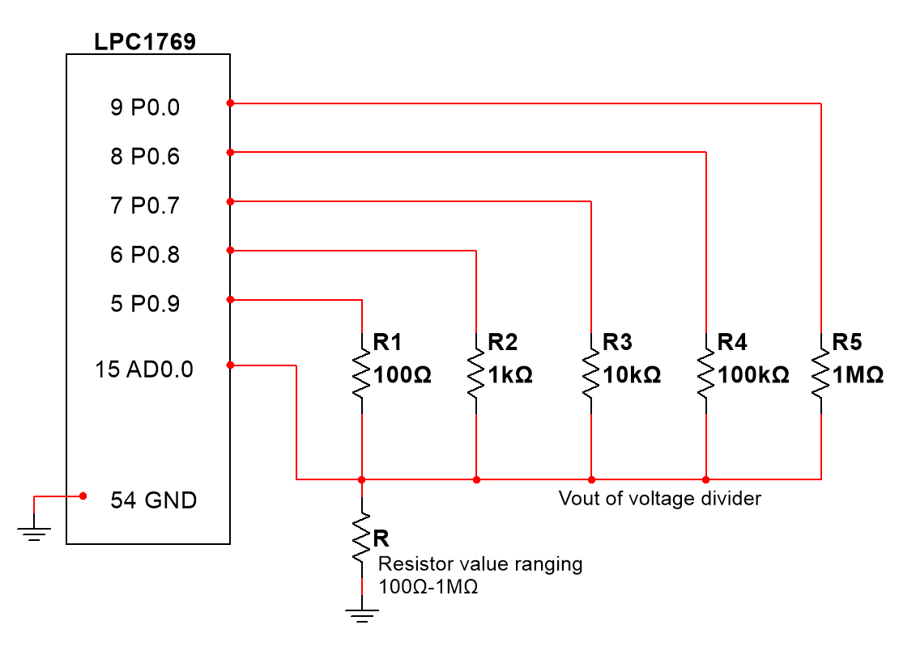
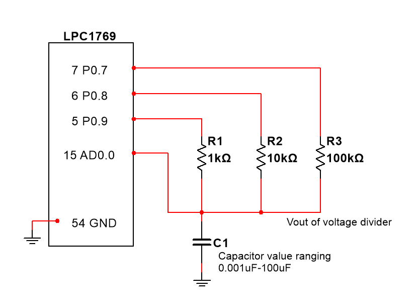

# Capacitance and Resistance Meter with LCP1769 Micro Controller

This repository comprises of source code and schematics for accurately measuring resistance and capacitance using an LCP1769 microcontroller. The code has been written entirely in C++, ensuring reliability and consistency in the measurements.

The capacitance meter code has been meticulously calibrated to measure capacitance values spanning from 0.001uf to 100uf. Similarly, the resistance meter has been fine-tuned to accurately measure resistance values within the range of 100Ω to 1MΩ.

## ChatGPT Insight

### ChatGPT provided a wealth of valuable insights on the topic of measuring electrical components. Here are some of the chatboxes responses.

* For the capacitor range you specified (0.001 μF to 10 μF), a good resistor value to use would be around 1 kΩ to 100 kΩ. 
This will give you a time constant between 10 μs and 10 ms, which is suitable for this range of capacitance values.
If you use a resistor value of 10 kΩ, for example, the time constant would be: τ = RC = 10 kΩ x 0.001 μF = 10 μs
This would allow you to measure capacitors as small as 0.001 μF with a resolution of 10 μs.
On the other hand, if you use a resistor value of 100 kΩ, the time constant would be: τ = RC = 100 kΩ x 10 μF = 1 s
This would allow you to measure capacitors as large as 10 μF with a resolution of 1 second. Keep in mind that the accuracy 
of your capacitance meter will depend on the accuracy of the components used and the circuit design, so you may need to calibrate 
your meter for more precise measurements. 

* Using multiple circuits with different resistor values can be a good approach to increase the measurement range and resolution of 
your capacitance meter. By using different resistor values, you can create multiple RC time constants and cover a wider range of 
capacitance values. For example, you could use three circuits with resistors of 1 kΩ, 10 kΩ, and 100 kΩ, respectively. This would 
give you time constants of 1 μs, 10 μs, and 100 μs, covering a capacitance range from 0.001 μF to 10 μF with a resolution of 1 μs.
To implement multiple circuits, you can use a multiplexer or switch to select the appropriate resistor for each measurement. You can 
then measure the charging time for each circuit and calculate the capacitance value using the appropriate time constant.
Keep in mind that using multiple circuits can increase the complexity and cost of your capacitance meter, and you may need to consider
factors such as switching speed and signal interference. However, it can be a useful approach to improve the accuracy and versatility of 
your measurements.

## Schematics and Drawings
The voltage dividers are programmed to have only one load resistors connected to V_cc at any given time. All other resistors are set to float bases on digital to analog values read at the pin.

## Resources 

* The most valuable resource was my partner, Nhi Loung, an accomplished electrical engineer from Oklahoma. Should you need to get in touch with her, her email address is nhi.luong13@gmail.com.
* This [link](https://www.eecs.tufts.edu/~dsculley/tutorial/rc/rc3.html#:~:text=The%20RC%20time%20constant%20is,the%20resistance%20R%2C%20in%20Ohms) is a great resource for understanding how one can measure a capacitor using the RC time constant.

